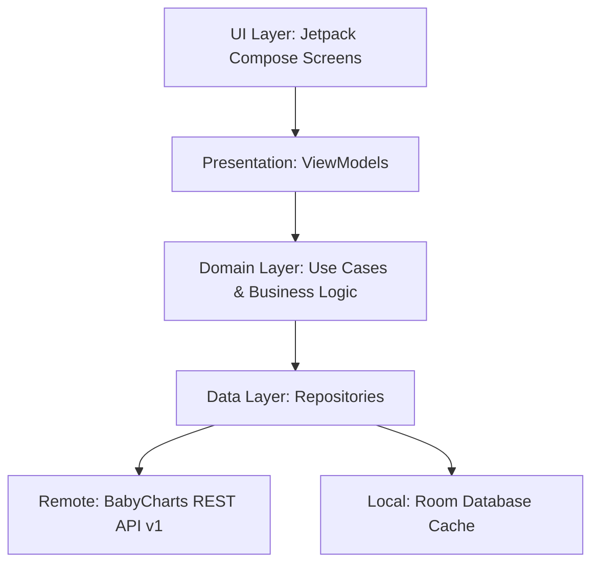

# 🤖 Native Android Architektur-Plan (#226 / BC-201)

Dieses Dokument definiert die Architektur für eine eigenständige, native BabyCharts Android-App.

---

## 🏗️ 1. Technologie-Stack

- **Programmiersprache:** Kotlin 2.x
- **UI Framework:** Jetpack Compose (Material Design 3 mit Dark Theme Support)
- **Architektur-Pattern:** Clean Architecture + MVI / MVVM (Unidirectional Data Flow)
- **Dependency Injection:** Dagger Hilt
- **Netzwerk:** Ktor Client / Retrofit 2 + Kotlinx.Serialization
- **Lokale Datenbank (Offline-Cache):** Room SQLite mit SQLCipher
- **Asynchrone Verarbeitung:** Kotlin Coroutines & Flow

---

## 🏛️ 2. Schichtenarchitektur

---

## 🔄 3. Offline-First & Synchronisation

1. **Read-Flow:** ViewModels beobachten Room Flows (`Local-First`). Daten werden sofort angezeigt, auch ohne Internet.
2. **Background-Sync:** WorkManager prüft periodisch auf Änderungen (`GET /api/v1/profiles`).
3. **Optimistic Locking:**
   - Jedes Kinderprofil besitzt ein `version` Feld.
   - Bei Schreibkonflikten (`409 Conflict`) bietet die App einen interaktiven Diff-Dialog zur Zusammenführung an.
